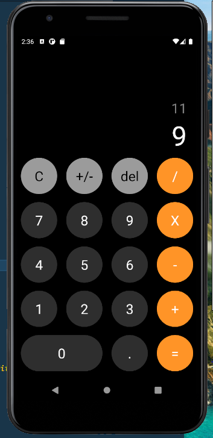
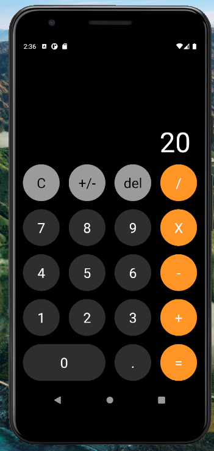

# iOS calculator

Done with React Native and Typescript
Created a custom Hook named useCalculator which contains all the logic for doing all of the basic operations (add, substract, multiplicate and divide)

 

  Made by Antonio Salazar.
